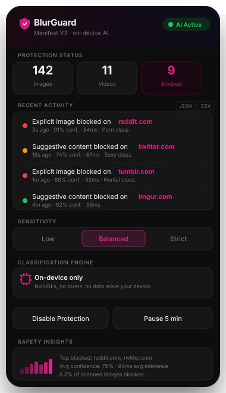
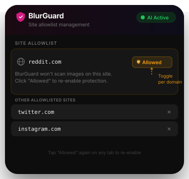

<div align="center">


[](#)
[](#)
[](#)
[](#)
[](#)
[](#license)

</div>

A Chrome extension that classifies every image and video in your browser using a TensorFlow.js neural network running entirely on your GPU — no server, no API key, no pixel data ever transmitted.

---

## Demo

<div align="center">

<br/><br/>
&nbsp;&nbsp;
</div>

---

## The Problem It Solves

NSFW content appears before filters catch it. DNS-level blockers kill entire domains. CSS blur shifts your layout. Cloud classifiers send your pixel data to someone else's server. And once something is revealed, there's no way to cover it again.

BlurGuard operates **inside the page**, element by element, in real time — before anything renders. It scans on `document_idle`, watches via `MutationObserver` for anything injected later, wraps every flagged element in a dimension-preserving container with zero layout shift, and pushes live state to the popup with no polling.

Inference runs in a hidden **offscreen document** using NSFW.js on TensorFlow.js. The offscreen document executes as the extension's own origin, which means it can fetch any image the user's browser can see — including auth-gated content — without forwarding credentials to a third party. In v1, the build flag `CLOUD_BACKEND_ENABLED=false` dead-code-eliminates the Sightengine path entirely: the Sightengine module does not appear in the shipped bundle at all.

---

## What It Does

```
╔══════════════════════════════════════════════════════════════════════════════╗
║                    FOUR CONTEXTS, ONE CONSISTENT INTERFACE                   ║
╠═══════════════════╦══════════════════════════╦═════════════════════════════╗  ║
║  CONTENT SCRIPT   ║  OFFSCREEN CLASSIFIER    ║   BLUR OVERLAY              ║  ║
║  ──────────────── ║  ────────────────────    ║   ───────────               ║  ║
║   + <video>  ║  NSFW.js v4.3            ║  position:relative wrap     ║  ║
║  MutationObsvr    ║  TensorFlow.js 4.22      ║  mirrors all layout CSS     ║  ║
║  WeakSet dedup    ║  WebGL backend (GPU)     ║  zero layout shift          ║  ║
║  IntersctObsvr    ║  WASM fallback           ║  backdrop-filter glass      ║  ║
║  viewport prio    ║  serial GPU queue        ║  pane on top                ║  ║
║                   ║  URL coalescing          ║  click-to-reveal            ║  ║
║  VideoSampler     ║  offscreen doc created   ║  250ms ease transition      ║  ║
║  4s frame rate    ║  on first classify →     ║                             ║  ║
║  seek + play      ║  torn down after 30s     ║                             ║  ║
║  event hooks      ║  idle                    ║                             ║  ║
╠═══════════════════╩══════════════════════════╩═════════════════════════════╣  ║
║  LIVE POPUP DASHBOARD                                                      ║  ║
║  ────────────────────                                                      ║  ║
║  Images scanned · Videos scanned · Total blocked — live counters           ║  ║
║  Detection feed · domain · confidence % · inferenceMs · relative timestamp ║  ║
║  7-bar confidence sparkline · Top detected domains · Sensitivity toggle    ║  ║
║  Per-domain allowlist · Pause 5 min · Export feed as CSV or JSON           ║  ║
╚════════════════════════════════════════════════════════════════════════════╚══╝
```

---

## How It Works

Four isolated Chrome extension contexts connected by a fully-typed message bus. The popup never polls — every state change triggers a `STATE_UPDATED` push from the background.

```
 ┌────────────────────────────────────────────────────────────────────────────┐
 │  POPUP  ·  React 19 UI                                                     │
 │                                                                            │
 │  ┌────────┐  ┌──────────────────┐  ┌───────────────────────────────────┐   │
 │  │ Header │  │ ProtectionStatus │  │         DetectionFeed             │   │
 │  └────────┘  └──────────────────┘  └───────────────────────────────────┘   │
 │  ┌──────────────────┐  ┌──────────────────┐  ┌────────────────────────┐    │
 │  │ SensitivityCtrl  │  │ AllowlistControl │  │     SafetyInsights     │    │
 │  └──────────────────┘  └──────────────────┘  └────────────────────────┘    │
 └───────────────────────────── │ ──────────────────────────────────────────┘
               chrome.runtime.sendMessage / onMessage
 ┌───────────────────────────── │ ──────────────────────────────────────────┐
 │  BACKGROUND  ·  MV3 Service Worker            ◄───────────────────────   │
 │                                                                           │
 │  • Owns BlurGuardState in chrome.storage.local                            │
 │  • Viewport-priority classify queue (max 100 items)                       │
 │  • LRU verdict cache — 500 URLs, re-derives verdict per sensitivity        │
 │  • CLASSIFY_REQUEST → cache check → enqueue → processClassify             │
 │  • Broadcasts PROTECTION_TOGGLED / SENSITIVITY_CHANGED / ALLOWLIST_UPDATED│
 │  • Idles offscreen doc after 30 s of empty-queue inactivity               │
 └───────────────────────────── │ ──────────────────────────────────────────┘
           chrome.runtime.sendMessage (OFFSCREEN_CLASSIFY)
 ┌───────────────────────────── │ ──────────────────────────────────────────┐
 │  OFFSCREEN DOCUMENT  ·  Hidden extension page with DOM + WebGL            │
 │                                                                           │
 │  • Created on-demand when first classify request exits the queue          │
 │  • NSFW.js model loaded from extension bundle (models/nsfwjs/model.json)  │
 │  • TF.js WebGL backend — GPU inference; WASM fallback if WebGL absent     │
 │  • Serial GPU queue (queueTail Promise chain) — one classify() at a time  │
 │  • URL coalescing — concurrent requests for the same URL share one pass   │
 │  • Reports: predictions[] + inferenceMs + decodeMs + queueWaitMs          │
 └───────────────────────────── │ ──────────────────────────────────────────┘
           chrome.tabs.sendMessage (BLUR_DECISION)
 ┌───────────────────────────── │ ──────────────────────────────────────────┐
 │  CONTENT SCRIPT  ·  Injected into every tab   ◄────────────────────────  │
 │                                                                           │
 │  ┌──────────────────┐   ┌──────────────────┐   ┌────────────────────┐    │
 │  │  mediaDetector   │ → │  VideoSampler    │ → │   blurOverlay      │    │
 │  │  WeakSet scan    │   │  4s frame sample │   │  DOM wrap + glass  │    │
 │  │  MutationObsvr   │   │  IntersectObsvr  │   │  click-to-reveal   │    │
 │  └──────────────────┘   └──────────────────┘   └────────────────────┘    │
 └────────────────────────────────────────────────────────────────────────────┘
```

### Why chrome.storage, Not Module Variables

MV3 service workers are killed after ~30 seconds of inactivity. BlurGuard survives by persisting **all** state to `chrome.storage.local` — never module-level variables — and re-hydrating on every `GET_STATE` request. Every detection, counter, and setting is durable across sleep/wake cycles.

The offscreen document, in contrast, is intentionally ephemeral: it is created on-demand when a classify request first reaches the queue, and torn down after 30 seconds of idle so the WebGL context and model tensors (~150–250 MB) are released between browsing bursts.

---

## The Classifier

### Model

NSFW.js 4.3 on TensorFlow.js 4.22. MobileNet V2 architecture trained on labelled explicit and safe image sets. Outputs five probability classes:

```
Porn · Hentai · Sexy · Neutral · Drawing
```

BlurGuard applies a two-tier verdict: **explicit** (`Porn + Hentai` probability sum exceeds threshold) or **suggestive** (`Sexy > Neutral` by a margin, exceeds block threshold). The raw prediction scores are cached; the verdict is re-derived at read time so a single cache entry serves all three sensitivity levels without a re-classify.

### Sensitivity Thresholds

```
SENSITIVITY THRESHOLDS  (Porn+Hentai sum for explicit · Sexy-Neutral margin for suggestive)
────────────────────────────────────────────────────────────────────────────────────────────
[LOW]       explicit ≥ 0.60 · suggestive: never blocked
  • Conservative — near-certain explicit content only; sportswear and fitness safe

[BALANCED]  explicit ≥ 0.45 · suggestive block ≥ 0.78 · Sexy-Neutral margin ≥ 0.12
  • Everyday browsing — good precision/recall; yoga/fitness images safe

[STRICT]    explicit ≥ 0.35 · suggestive block ≥ 0.65 · Sexy-Neutral margin ≥ 0.06
  • Flag anything with moderate probability; some suggestive fashion FP expected
────────────────────────────────────────────────────────────────────────────────────────────
Threshold applied after every classify() call.
Sensitivity changes broadcast immediately to all open tabs with no re-classify needed —
the verdict cache stores raw scores and re-derives the verdict per the new sensitivity.
```

---

## Corpus Results

Threshold tuning was run against a hand-labeled set of **15 images** (10 safe, 5 explicit) during Phase 2.4 development. These are the actual numbers — no rounding.

| Sensitivity | Recall (explicit) | FP rate (safe) | Notes |
|---|---|---|---|
| Balanced | 4 / 5 — **0.80** | 0 / 10 — **0.00** | One known miss (see below) |
| Strict | 5 / 5 — **1.00** | 1 / 10 — **0.10** | FP on high-Sexy fashion image |
| Low | 3 / 5 — **0.60** | 0 / 10 — **0.00** | Conservative; misses moderate-confidence items |

**Known miss (nsfw-04):** A drawn/animated explicit image where the model returns `Drawing=0.968, Porn≈0, Hentai≈0`. The NSFW.js model has a hard ceiling on this content category — it outputs near-certain Drawing regardless of the image content. On-device recall for this category is ~0%. The v1.1 Sightengine backend closes this gap (its `native nudity-2.1` model handles drawn content correctly).

**Caveats:** n=15 is not statistically significant. The Phase 2.4 tuning also fixed a systematic **false-positive pattern**: yoga and fitness images in tight sportswear were inflating the `Sexy` class to 0.65–0.73. The Sexy-Neutral margin gate (`sexyNeutralMargin`) was introduced specifically to suppress these — yoga/fitness images remain unblocked at balanced sensitivity.

Full corpus evaluation against a statistically significant held-out set is a planned v1.1 deliverable.

---

## Performance

Measured from build artifacts and logged timing fields (`inferenceMs`, `decodeMs`, `queueWaitMs`, `latencyMs`). WebGL backend on a mid-range discrete GPU; WASM fallback numbers are ~3–5× higher.

| Metric | Typical | Range | What it measures |
|---|---|---|---|
| Cold backend init (`backendMs`) | ~800 ms | 300–2 000 ms | `tf.setBackend("webgl")` + `tf.ready()` |
| Cold model load (`loadMs`) | ~3 s | 1.5–8 s | `nsfwLoad()` reading ~38 MB shard files |
| Warmup classify (`warmupMs`) | ~200 ms | 100–500 ms | 1×1 dummy canvas — primes GPU pipeline |
| **Total cold load** (`totalColdLoadMs`) | **~4 s** | **2–10 s** | Sum of the three above; logged at startup |
| First real inference (`latencyMs`) | ~5 s | 3–20 s | Cold start — dominated by model load |
| Steady-state `inferenceMs` | ~80 ms | 20–150 ms | GPU work per image after model is warm |
| Steady-state `latencyMs` | ~150 ms | 50–300 ms | Fetch + decode + queue wait + inference |
| Cache hit `latencyMs` | ~3 ms | 1–5 ms | `chrome.storage.local` read + verdict re-derive |
| 40-image burst, last item | ~3.2 s | 1–6 s | Serial queue — K images × inferenceMs |
| 40-image burst, first visible item | ~150 ms | 50–300 ms | Viewport-priority queue jumps it to front |

To reproduce: load `dist/` unpacked → open a tab with many images → open SW DevTools → filter logs for `[BlurGuard offscreen]` and `[BlurGuard tfjs]`.

---

## Backend Comparison

|               | `tfjs` (v1 — ships)    | `sightengine` (v1.1 — built, held) |
|---------------|------------------------|------------------------------------|
| Latency       | ~80 ms steady-state    | ~200 ms (network round-trip)       |
| Accuracy      | NSFW.js recall 0.80+   | Sightengine native nudity-2.1      |
| Privacy       | **100% on-device**     | Raw pixels sent to Sightengine     |
| Setup         | None — model bundled   | API credentials required           |
| Works offline | Yes                    | No                                 |
| Drawn content | Known gap (recall ~0%) | Handles correctly                  |
| Build flag    | Always enabled         | `CLOUD_BACKEND_ENABLED=true`       |

The `sightengine` backend is fully implemented — `src/lib/sightengine.ts`, dual verdict paths in `offscreen.ts`, credential UI in `ApiBackendControl`. Rollup dead-code-eliminates it from the v1 bundle when the flag is false. Flipping the flag to `true` in `vite.config.ts` activates it without any other code changes.

---

## How the Blur Overlay Works (No Layout Shift)

Applying `filter: blur()` directly to an image causes a repaint that shifts surrounding elements. BlurGuard avoids this entirely:

```
Before BlurGuard:                 After BlurGuard:

┌─────────────────┐               ┌─────────────────┐  ← wrapper div
│                 │               │            │    exact same size + position
│      │      →        │                 │    as original element
│                 │               │─────────────────│
└─────────────────┘               │  🛡 BlurGuard       ← position:absolute, inset:0
                                  │  backdrop-filter│    backdrop-filter: blur(22px)
                                  └─────────────────┘
```

Step by step:

1. Capture `offsetWidth`, `offsetHeight`, and all layout CSS from the original element
2. Create a `position: relative` wrapper with **identical** dimensions, margin, flex properties, and border-radius
3. Swap the element for the wrapper in the DOM (no reflow)
4. Move the element inside the wrapper (fills 100%)
5. Append an absolutely-positioned glass pane with `backdrop-filter: blur()`

Result: **zero layout shift.** Surrounding elements never move.

---

## Message Protocol

All four contexts share a single typed contract. No stringly-typed messages — every type is an exhaustive discriminated union, every payload is typed.

```typescript
// src/types/messages.ts — the single source of truth

export type BlurGuardMessage =
  // Popup → background
  | GetStateMessage | SetEnabledMessage | SetSensitivityMessage
  | SetApiBackendMessage | SetApiConfigMessage | ResetStatsMessage
  | AddAllowlistDomainMessage | RemoveAllowlistDomainMessage

  // Content → background
  | ClassifyRequestMessage | ClassifyPrioritizeMessage | ClassifyCancelMessage
  | ReportDetectionMessage

  // Background → popup (push — no polling)
  | StateUpdatedMessage

  // Background → all tabs (broadcast)
  | ProtectionToggledMessage | SensitivityChangedMessage | AllowlistUpdatedMessage
  | BlurDecisionMessage

  // Background → offscreen
  | OffscreenPingMessage | OffscreenClassifyMessage

  // Offscreen → background
  | OffscreenReadyMessage | ClassifyResultMessage;
```

| Message | Direction | Payload |
|---|---|---|
| `CLASSIFY_REQUEST` | content → background | `{ id, url, kind, priority }` |
| `CLASSIFY_PRIORITIZE` | content → background | `{ id }` — promotes item in queue |
| `CLASSIFY_CANCEL` | content → background | `{ id }` — removes item from queue |
| `OFFSCREEN_CLASSIFY` | background → offscreen | `{ id, url, kind, backend, sensitivity }` |
| `BLUR_DECISION` | background → content | `{ id, verdict, inferenceMs, latencyMs }` |
| `STATE_UPDATED` | background → popup | full `BlurGuardState` |
| `PROTECTION_TOGGLED` | background → all tabs | `boolean` |
| `SENSITIVITY_CHANGED` | background → all tabs | `Sensitivity` |
| `ALLOWLIST_UPDATED` | background → all tabs | `string[]` |

---

## Repository Structure

```
blur-guard/
│
├── public/
│   ├── manifest.json              MV3 manifest · offscreen permission · CSP
│   ├── icons/                     icon16.png · icon48.png · icon128.png
│   ├── models/nsfwjs/model.json   NSFW.js model descriptor + weight shards (~38 MB)
│   └── wasm/                      TF.js WASM binaries (WebGL fallback)
│
├── offscreen.html                 Entry point for the hidden inference document
├── index.html                     Popup HTML · MV3-compliant CSP
├── vite.config.ts                 Multi-entry build · flat dist/ · __CLOUD_ENABLED__ flag
├── tsconfig.app.json              types:["chrome"] · @/* path alias · strict
└── tsconfig.node.json             types:["node"] for vite.config.ts
│
└── src/
    │
    ├── background.ts              SW hub · state owner · priority queue · verdict cache
    ├── content.ts                 Injected per tab · scan → request → blur
    ├── offscreen.ts               Offscreen doc · NSFW.js inference · serial GPU queue
    ├── main.tsx                   React 19 popup entry point
    ├── globals.d.ts               Ambient type for __CLOUD_ENABLED__ build constant
    │
    ├── types/
    │   └── messages.ts            BlurGuardMessage union · BlurGuardState · DetectionEvent
    │
    ├── lib/
    │   ├── mediaDetector.ts       MutationObserver + WeakSet DOM scanner
    │   ├── blurOverlay.ts         Layout-preserving wrapper · click-to-reveal
    │   ├── classifier.ts          verdictFromPredictions() · sensitivity threshold profiles
    │   ├── verdict-cache.ts       LRU cache · 500 URLs · raw scores · sensitivity re-derive
    │   ├── videoSampler.ts        Periodic frame capture · IntersectionObserver lifecycle
    │   ├── sightengine.ts         Sightengine cloud adapter (v1.1, flag-gated)
    │   ├── featureFlags.ts        __CLOUD_ENABLED__ build-constant bridge
    │   └── feedExport.ts          CSV + JSON detection history export
    │
    ├── hooks/
    │   └── useBlurGuard.ts        React ↔ background bridge · live STATE_UPDATED
    │
    ├── pages/
    │   └── Index.tsx              Popup root · single state owner · prop distribution
    │
    └── components/
        ├── blurguard/
        │   ├── Header.tsx             Logo + AI Active / Paused badge
        │   ├── ProtectionStatus.tsx   Live images · videos · blocked counters
        │   ├── DetectionFeed.tsx      Real-time event list · confidence · timing · export
        │   ├── SensitivityControl.tsx Low · Balanced · Strict toggle
        │   ├── ApiBackendControl.tsx  On-device label (v1) · cloud credential UI (v1.1)
        │   ├── AllowlistControl.tsx   Per-domain disable toggle + managed list
        │   ├── QuickActions.tsx       Enable / disable · pause 5 min · reset stats
        │   └── SafetyInsights.tsx     Sparkline · top domains · avg confidence
        └── ui/                        shadcn/ui primitives (40+ components)
```

---

## Getting Started

### Requirements

| | Minimum |
|---|---|
| Node.js | 18 |
| npm | 9 |
| Chrome | 120 |

### Install and Build

```bash
git clone https://github.com/dwakshar/blur-guard.git
cd blur-guard

npm install
npm run build
# → dist/ folder created with background.js, content.js, offscreen.js, index.html
```

### Load into Chrome

```
1.  chrome://extensions
2.  Enable "Developer mode"  (toggle, top right)
3.  Click "Load unpacked" → select the dist/ folder
4.  BlurGuard icon appears in your toolbar — you're live
```

The first classify on any tab triggers offscreen document creation and model load (~4 s cold). Subsequent classifications on the same session are warm (~80 ms).

### Development Workflow

```bash
# Terminal 1 — keep running
npx vite build --watch

# Edit any .ts file and save
# → Vite rebuilds in ~1s

# In Chrome → chrome://extensions → click ↺ refresh icon on BlurGuard
```

**Important:** Never test by running `npm run dev`. The Vite dev server uses `eval` for HMR, which Chrome's Content Security Policy blocks. Always load from `dist/`.

---

## All Commands

```bash
npm run build            # production build
npx vite build --watch   # rebuild on every .ts save
npx tsc --noEmit         # TypeScript validation, no output emitted
npm run lint             # eslint across src/
npm run test             # Vitest suite (62 tests)
```

---

## Privacy

BlurGuard does not collect analytics, telemetry, or usage data of any kind.

In v1, all classification runs inside a hidden **offscreen document** that loads the NSFW.js model from the extension's own bundle. The offscreen document executes as the `chrome-extension://` origin with no outbound network access except to fetch the image being classified — and that fetch uses `credentials: "omit"`, so no session cookies are forwarded. **No pixels, no URLs, and no data of any kind leave your browser.**

| | v1 (ships) | v1.1 (opt-in cloud) |
|---|---|---|
| Image pixels | Stay on device | Sent to Sightengine |
| Image URLs | Stay on device | Sent to Sightengine |
| Detection history | `chrome.storage.local` only | `chrome.storage.local` only |
| Analytics / telemetry | None | None |
| API credentials | N/A | `chrome.storage.local` only — never broadcast |

The cloud option in v1.1 will require explicit opt-in through the popup, accompanied by a verbatim privacy disclosure (visible today in `ApiBackendControl.tsx`): *"while enabled, the raw pixels of every image on pages you visit are sent to Sightengine's servers."*

---

## Permissions

```jsonc
"permissions": [
  "storage",    // persist BlurGuardState + verdict cache across SW restarts
  "activeTab",  // identify the active tab for the allowlist toggle
  "scripting",  // inject content script into pages
  "tabs",       // broadcast messages to all open tabs
  "offscreen"   // create the hidden inference document
]
```

---

## Tech Stack

| Layer | Choice | Reason |
|---|---|---|
| Extension platform | Chrome MV3 | Only supported format going forward |
| Language | TypeScript 5.8 | Shared types across 4 isolated contexts |
| UI framework | React 19 | Popup UI + composition |
| Styling | Tailwind CSS v4 | Design tokens · utility classes · custom glow utilities |
| Build tool | Vite 7 | Multi-entry rollup · flat output required by Chrome |
| UI components | shadcn/ui | Accessible · unstyled · composable |
| ML inference | NSFW.js 4.3 + TensorFlow.js 4.22 | On-device WebGL inference — no API key |
| Model format | TF.js graph model (SavedModel) | Faster than layers format; ~38 MB shards |
| State | chrome.storage.local | Survives service worker sleep/wake cycles |
| Tests | Vitest 4.1 | 62 tests — queue, cache, allowlist, round-trip |
| Icons | lucide-react | Tree-shakeable · consistent stroke width |

---

## Roadmap

- [x] On-device NSFW.js inference via offscreen document
- [x] Viewport-priority classify queue with CANCEL + PRIORITIZE
- [x] LRU verdict cache — sensitivity re-derivation without re-classify
- [x] Per-domain allowlist — one-tap disable on any site
- [x] Pause timer — "Pause for 5 minutes" with live countdown in popup
- [x] Detection history export — CSV and JSON
- [x] Video frame sampling — VideoSampler with seek/play hooks (inference stub in place)
- [ ] v1.1 — Optional Sightengine cloud backend (built, held behind `CLOUD_BACKEND_ENABLED` flag)
- [ ] v1.1 — Full corpus evaluation against held-out benchmark set
- [ ] Full on-device video inference — canvas frame decode + GPU queue integration
- [ ] Firefox support — port to WebExtensions API (MV2 compatible)
- [ ] WXT migration — replace custom Vite config with proper extension tooling

---

## Contributing

```bash
git checkout -b feature/your-thing

# New threshold / verdict logic → src/lib/classifier.ts (pure functions, no Chrome knowledge)
# New overlay behaviour        → src/lib/blurOverlay.ts
# New popup components         → src/components/blurguard/
npm run test

# Verify in Chrome
npm run build

# PR: describe the media signal you're consuming and what it detects
```

TypeScript must pass with zero errors before any PR is merged.

```bash
npx tsc --noEmit
npm run lint
```

---

## License

MIT — see [LICENSE](./LICENSE)

---

<div align="center">

<br/>

```
  built with  chrome.runtime  ·  typescript  ·  react 19  ·  tensorflow.js  ·  obsessive attention to layout
```

_If BlurGuard saved your day, a ⭐ means a lot:)._

<br/>

</div>
